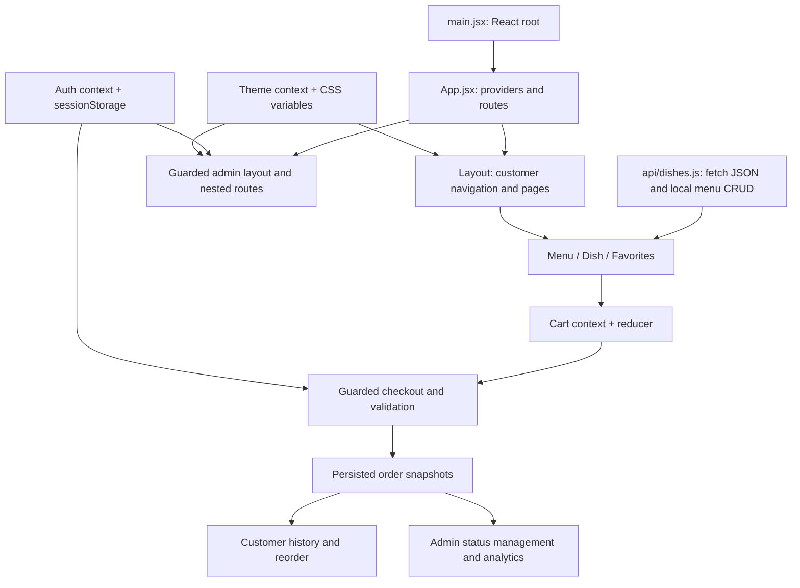

# Addis Eats: presentation and viva guide

## Five-minute demonstration

1. **Purpose (30 seconds):** Addis Eats is a React food-ordering frontend for Addis Ababa. It follows the supplied customer/admin specification. Clearly identify it as a local demo.
2. **Browse (45 seconds):** Open Menu, select Ethiopian and point to the category in the URL. Refresh to show the filter remains. Search for a dish; show the empty state for an unmatched search.
3. **Order (90 seconds):** Open Doro Wat, explain ingredients/spice information, favorite it, add two portions, adjust Cart and select an area. Sign in using sample data. Show invalid form feedback, then place an order and inspect history.
4. **Admin (60 seconds):** Sign in with the displayed demo credentials. Edit a dish, show the confirmation before deletion, then move the customer order through its statuses. Explain that charts are derived from saved orders.
5. **Architecture and resilience (60 seconds):** Show the diagram below, point to the pure cart reducer and validation functions, then describe failure-path tests.
6. **Tradeoffs (15 seconds):** Explain the local JSON API stand-in, client-side demo sessions, and the backend/security work needed before a real launch.

## Architecture

## Questions you should be able to answer

**Why feature folders?** Menu, cart, checkout and orders each own their components and logic. Generic controls live in ui; shared pure helpers live in utils. This makes a feature easier to understand without scanning one huge components folder.

**Why Context for auth and theme?** Multiple distant components need the same session and theme. Providers make those values available without passing them through every intermediate component.

**Why is cart shared?** Cards, details, the header badge, Cart and Checkout all need its current state. The reducer defines how add, quantity, remove, clear and replace work. Count and subtotal are calculated, not separately stored.

**Why no Zustand or Redux?** The starting project had no external store. Context + useReducer handles this project's small shared cart clearly. Adding another store would duplicate responsibilities. Zustand is a valid alternative if future requirements justify it.

**Where does search live?** In this implementation search is URL state in Menu, alongside category. This allows refresh and shareable searches. It is not in a global provider. The input updates immediately.

**Why no debounce?** Filtering five local dishes is cheap. Delaying it would make feedback less immediate without avoiding network requests. For a future server-backed search, add a debounced value and cancel stale requests; the current menu fetch already supports cancellation.

**Why URL category state?** /menu?category=Ethiopian is shareable and survives refresh. React Router's useSearchParams is the source of truth.

**What does useEffect do?** useDishes fetches resource data and cancels work during cleanup. Cart saves changes to storage, Theme updates document styles, and Modal opens/closes the native dialog while restoring focus.

**Why custom hooks?** useDishes encapsulates loading/error/retry and cancellation; usePersistentState handles validated storage reads and reports failed writes; useAuth/useCart hide Context access details.

**Why useMemo and React.memo?** Menu derives its filtered list with useMemo. DishCard uses memo for unchanged props; its own cart/favorites Context changes can still render it. useCallback keeps retry and persistent setter callbacks stable. These are limited choices, not a claim that every render needs optimization.

**How was performance reviewed?** A browser test wraps the actual application in React Profiler only in the test harness. It measures development commits during menu load, search typing and add-to-cart. No profiling code or fake delay is shipped in the product. Timings are machine-dependent, not a production SLA. Inspect the JSON attachment in test-results. To explore further, install React DevTools, select Profiler, record a cart or search interaction, and inspect why the relevant components rendered.

**Why protect checkout?** A demo customer identity associates the saved order with a local history. The guard redirects to sign-in and retains the intended destination and delivery area. It is not real authorization: a production server must authenticate and authorize every request.

**Why separate customer/admin sessions?** Customer browsing should not grant admin access. Admin uses a separate sessionStorage flag and a guarded nested group. This is only an educational frontend gate; real permissions cannot be secured in browser storage.

**How is an order placed safely in this demo?** Validate fields, re-read current dishes, reconcile availability/prices, persist a snapshot, show confirmation, then clear the cart. If saving fails, display the error and keep the cart. Double submissions are guarded while the operation runs.

**Why store snapshots in orders?** Editing or removing a dish must not rewrite the price and name in past orders. Reorder deliberately looks up current dishes instead.

**Why lazy loading?** Checkout and admin are less frequently visited, so they live in separate production chunks. Suspense displays a loading state while the code loads.

**Why an error boundary?** It catches rendering failures below it and offers reload/home recovery. It does not catch async fetch or event-handler errors; those need their own try/catch and state.

**Why a Portal?** Admin forms and confirmation dialogs render at document.body, away from layout clipping. A native dialog gives modal focus containment and inert background behavior; our shell handles title, Escape, close and focus restoration.

**Why one application for admin?** The specification calls for a nested guarded route group, and it can reuse menu APIs, order state, UI controls and the theme.

**How is accessibility addressed?** Native links/buttons, meaningful accessible names, associated form labels/errors, skip link, visible focus, keyboard-operated dialogs, live notifications and reduced-motion CSS. Automated keyboard checks supplement manual review; they are not a full assistive-technology certification.

**What would change for production?** Replace local persistence with authenticated APIs, enforce server-side roles and validation, verify customer identity, protect private data, make order creation idempotent on the server, integrate real delivery/payment systems if needed, and configure HTTPS/deployment monitoring. Do not describe the current demo as a live ordering service.

## Debugging example to explain

Bug: a customer adds a dish, then an admin changes its price before checkout.
Reproduce the sequence → compare cart snapshot with current menu → reconcile before saving → show a review message → verify no order was created at the old total. The browser suite covers this exact failure path.

## Git story

The work is split into scoped commits: foundation, domain helpers/data, shared UI, feature state, customer screens, checkout, admin tools, integration/styles, tests and documentation. Each commit stages explicit project paths; unrelated repository files remain untouched.
